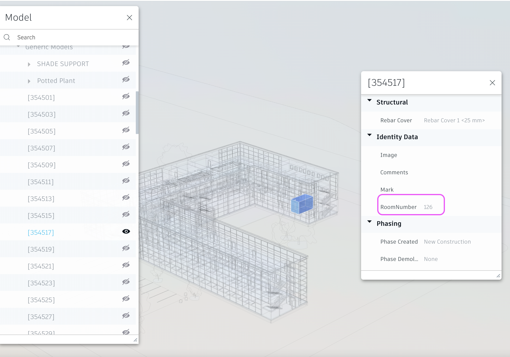

# rooms-spaces-design-automation-script

## Description
This is Postman script to test Design Automation of Revit with [Room Extract](../plugin) 

## Steps
1. **Forge Account**: Learn how to create a Forge Account, activate subscription and create an app at [this tutorial](http://learnforge.autodesk.io/#/account/). Make sure to select the service **Design Automation V3**.

2. Install Postman and import [collection](RoomExtractor.postman_collection.json) and [enviroment variables](RoomExtractor.postman_environment.json)
{:height="50%" width="50%"}   
3. Input  enviroment variables client Id and client Secret which come from the step #1. Input enviroment variables dasNickName with your own prefarable name 
   
4. Build the project [Room Extract](../plugin) to generate the [app bundle](../plugin/) zip. Note: ensure the event delegation in [OnStartup]() has swtiched to 
````
DesignAutomationBridge.DesignAutomationReadyEvent += HandleDesignAutomationReadyEvent;
````
5. Follow the steps below to test:

   - 0 Run 00-New token.  
   - 1 Run 01-Create app bundle. This is to create storage for custom app    bundle
   - 2 Select 03-Upload app bundle to Design Automation, select the bundle zip in step #4, run. This is to upload the binary to the app storge 
     

   - 3 Run 03-Create a new app bundle alias
   - 4  Run 04-Create Activity. 
   - 5 05-Create activity alias

   - 6 Select 06-Send Workitem. Input the url of your own source Revit model (direct downloads, signed url, or downloads with HTTP header for credensial). Run the script
      

   - 7 Run 07-Get Workitem status 
      

   when the status in 7) is **succeeded**, check if the outfile is available in the storage you specificed. Send it to https://viewer.autodesk.com/ to check if the room spaces have been added under **Generic Model** 
      


## Troubleshooting
1. if status in 5.7) is not **succeeded**, get the report url, download the log file
   
2. If the report indicates the failure might probably come from app bundle, fix the issue, and rebuild the app bundle. to make simple test, run script **Delete app bundle** and **Delete Activity** and repeat all steps in 6. 


 

